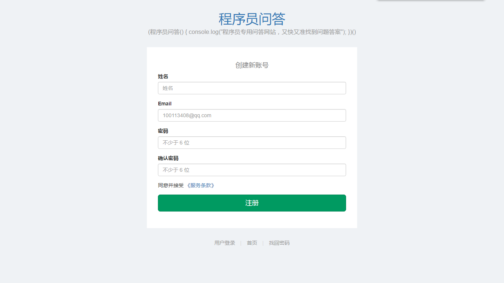
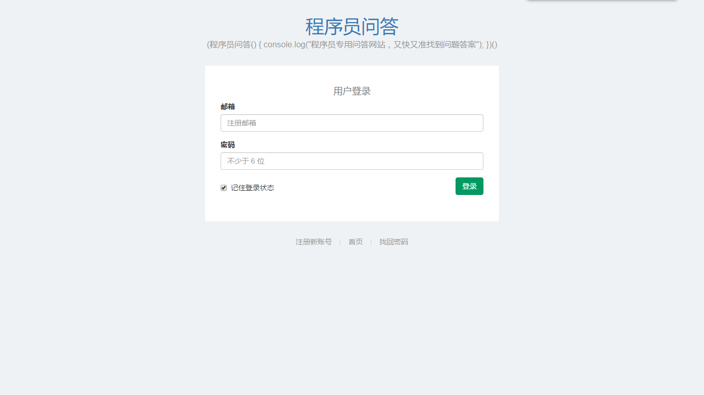
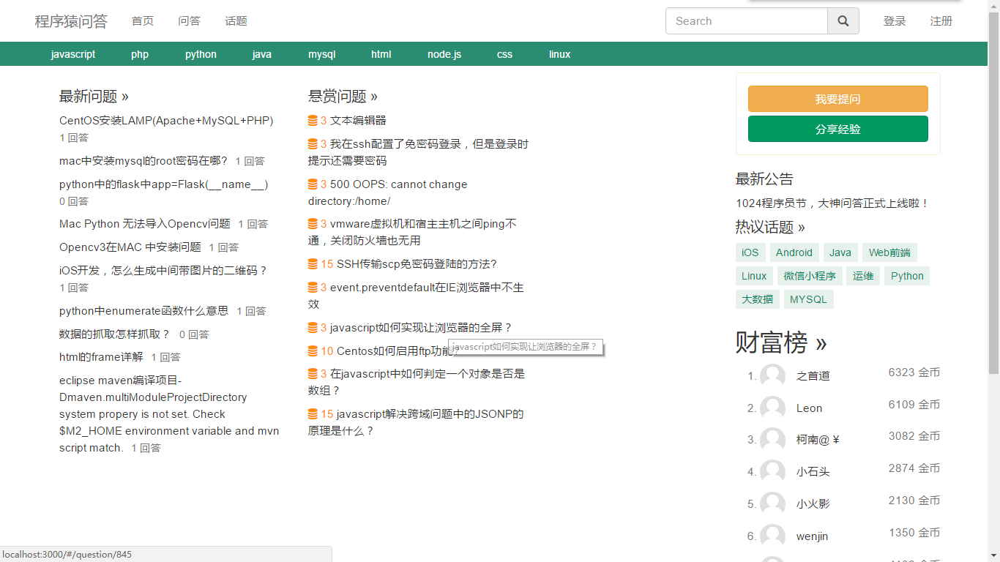
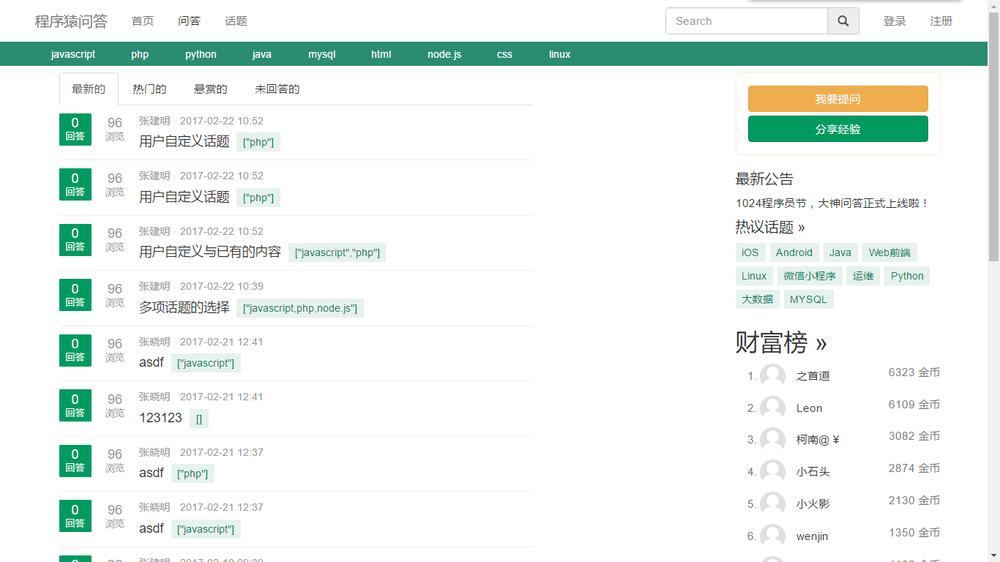
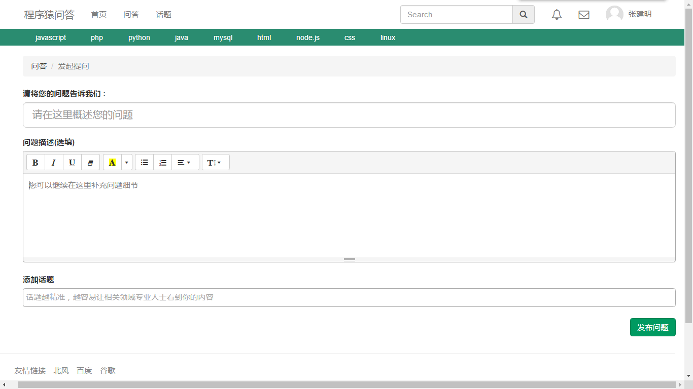
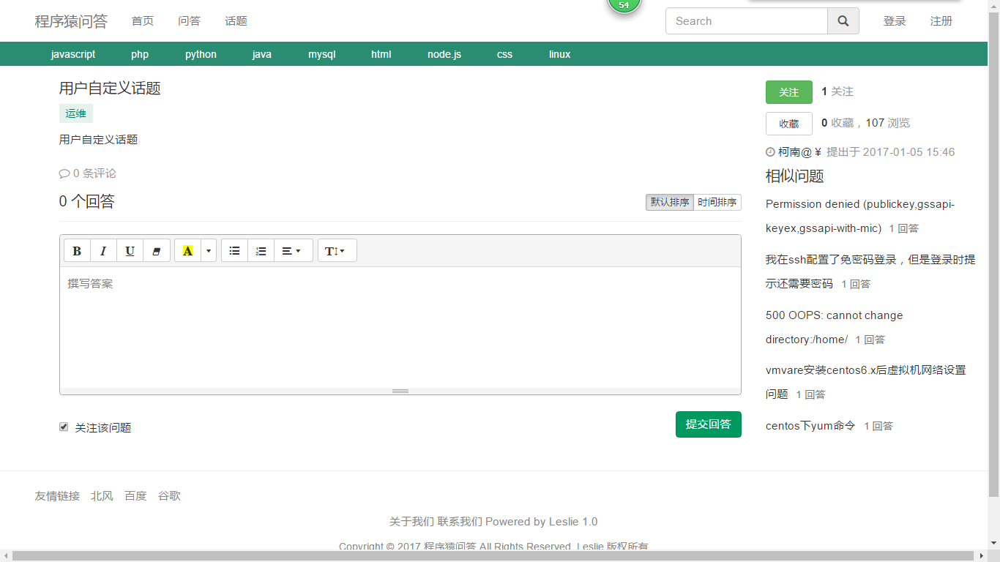

question 
=========

> 程序猿问答项目


## 安装
clone
```git
$ git clone https://github.com/Lesliezjm/question.git
```

安装nodejs
- `windows`: [参考文章](http://jingyan.baidu.com/article/a948d6515d4c850a2dcd2e18.html).
- `mac`: [参考文章](http://blog.csdn.net/baihuaxiu123/article/details/51868142).


安装modules

```npm
$ cd question
$ npm install
```

安装静态资源依赖包
```npm
$ cd question/public
$ bower install
```

运行服务器
```
$ cd question
$ npm run start
运行浏览器输入 http://localhost:3000
```

## 目录结构

```
question  项目目录
├─bin               项目入口
│  ├─www                www入口文件
├─common            公共函数
├─config            项目配置文件
├─dal               模型业务逻辑处理
├─logs              日志文件
├─models            模型骨架
├─public            项目主题
│  ├─css                公共样式
│  ├─img                图片资源
│  ├─js                 js文件
│  ├─static             组件
│  │  ├─components      组件
│  ├─templates          模板
│  ├─index.html         首页入口
│  ├─login.html         登陆
│  ├─register.html      注册
├─routers           路由文件
├─static            其他静态资源
├─views             jade模板
├─app.js            项目后台主文件
├─package.json      npm包管理
├─README.md         
```

注册页面


登录页面


首页


问题列表


我要提问


回答

